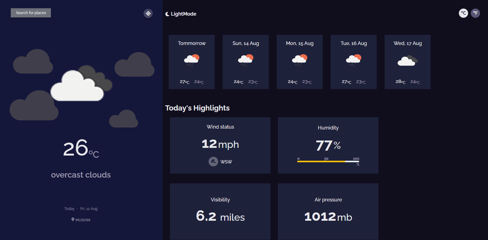
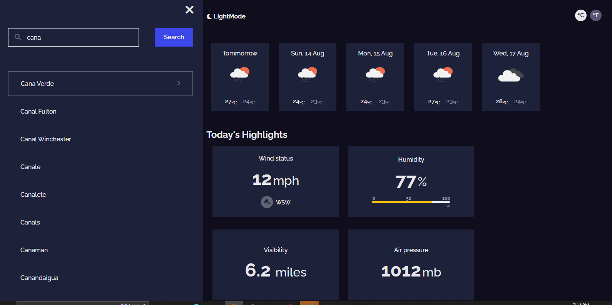
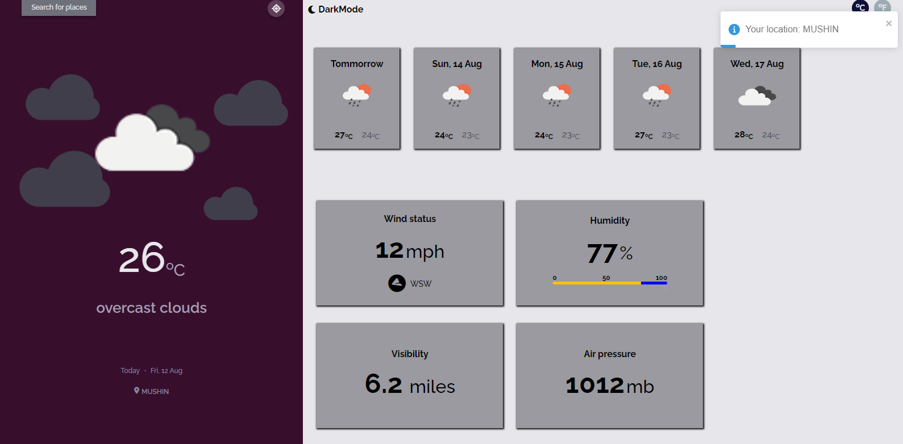

<!-- Please update value in the {}  -->

<h1 align="center">Weather App</h1>

<div align="center">
  <h3>
    <a href="https://{your-demo-link.your-domain}">
      Demo
    </a>
    <span> | </span>
    <a href="https://{your-url-to-the-solution}">
      Solution
    </a>
    <span> | </span>
  </h3>
</div>

<!-- TABLE OF CONTENTS -->

## Table of Contents

- [Overview](#overview)
  - [Built With](#built-with)
- [Features](#features)
- [How to use](#how-to-use)
- [Contact](#contact)

<!-- OVERVIEW -->

## Overview





### Built With

<!-- This section should list any major frameworks that you built your project using. Here are a few examples.-->

- [React](https://reactjs.org/)
- [Bootstrap]
- [openweathermap-Api]
## Features

<!-- List the features of your application or follow the template. Don't share the figma file here :) -->

A weather app which could be used to get the curent weather of a particular location. Toggles between dark and light mode, can modify the weather temperature unit between Celsius and Fahrenheit, can get the weather of your location.

## How To Use

<!-- Example: -->

To clone and run this application, you'll need [Git](https://git-scm.com) and [Node.js](https://nodejs.org/en/download/) (which comes with [npm](http://npmjs.com)) installed on your computer. From your command line:

```bash
# Clone this repository
$ git clone https://github.com/your-user-name/your-project-name

# Install dependencies
$ npm install

# Run the app
$ npm start
```

## Contact

- GitHub [@Bluebberies](https://{github.com/Bluebberries)
- LinkedIn [@Francis-Okonkwo](https://www.linkedin.com/in/francis-okonkwo-51a388232/)
- Twitter [@fran__cies](https://twitter.com/fran__cies)
- Facebook [@Fran Cis](https://web.facebook.com/francis.okonkwo.946517)
- Instagram [@fran__cies](https://www.instagram.com/fran__cies/)
